AIRISC User Guide
=================

.. contents:: Content
   :depth: 2

Target Audience
===============
This document is for hardware developers who want to integrate the AIRISC RISC-V core or the AIRISC
Core Complex into their own FPGA- or ASIC-designs. It is also for embedded software developers who
use an AIRISC based target platform.

Introduction
============

Compliance with the RISC-V specification
----------------------------------------
The following revisions of the RISC-V specification is implemented in the current version:

*   Unprivileged ISA spec v. 20191213  
*   Privileged ISA spec v. 20211203  
*   External Debug spec v. 0.13.2

AIRISC architecture overview
----------------------------
The AIRISC core implements the RISC-V ISA as a 32 bit harvard architecture with a five-stage pipeline.
There are two AHB lite system interfaces for instruction and data access. The base ISA is RV32I.
Extensions to the ISA can be added via a coprocessor interface (PCPI and RVX are supported). The
AIRISC Core Complex comprises a hardware multiplier / divider unit (MUL/DIV) as well as compressed
instructions (RV32IMC) as standard extensions.

Several standard peripherals are included in the AIRISC Core Complex: an MTIME compatible timer, a
UART, an SPI master device, an ICAP dynamic reconfiguration port (on FPGAs) and a JTAG based debug
transport module.

Additional ISA extenstion modules are available under a comercial license from
`Fraunhofer IMS <http://www.ims.fraunhofer.de>`_ and will be relased under Solderpad license after
a comercial-only period. Currently available extensions are:

* P - SIMD extension
* eAI - embedded AI package including hardware accelerators and software libraries
* ...

Memory map
==========
Fig. 1 shows the memory map of the processor. A modification of the memory partitioning is feasible,
e.g. to change mapping of peripherals of add additional memory areas (e.g. for non volatile memory).
The following list shows a suggestion for the basic memory organization:

*   Address ``0x80000000`` is the entrance point after reset
*   The area below ``0x80000000`` is reserved for debug functionality
*   The area above ``0xC0000000`` is reserved for peripheral modules

|

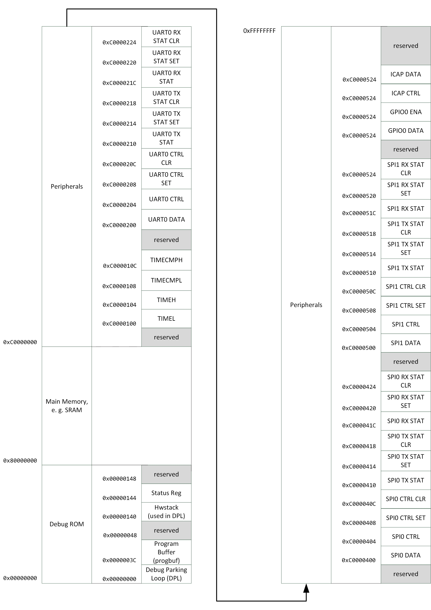

   Fig. 1: AIRISC memory map

|

The base address for all peripherals included within the Core Complex can be configured via the
``airi5c_arch_options.vh`` file (section "Memory mapped peripherals"). Tab. 1 shows a summary of
all default peripherals and their default base addresses.

Tab. 1: Default peripherals and corresponding memory addresses in the AIRISC Core Complex

+----------------+------------+-------------------+--------------------------------------+
| address        | access     | name              | description                          |
+================+============+===================+======================================+
| ``0xC0000100`` | R/W        | TIMEL             | System Timer Register (LSB)          |
+----------------+------------+-------------------+--------------------------------------+
| ``0xC0000104`` | R/W        | TIMEH             | System Timer Register (MSB)          |
+----------------+------------+-------------------+--------------------------------------+
| ``0xC0000108`` | R/W        | TIMECMPL          | System Timer Compare Register (LSB)  |
+----------------+------------+-------------------+--------------------------------------+
| ``0xC000010C`` | R/W        | TIMECMPH          | System Timer Compare Register (MSB)  |
+----------------+------------+-------------------+--------------------------------------+
| ``0xC0000200`` | R/W        | UART0             | Base address of UART0                |
+----------------+------------+-------------------+--------------------------------------+
| ``0xC0000400`` | R/W        | SPI0              | Base address of SPI0                 |
+----------------+------------+-------------------+--------------------------------------+
| ``0xC0000600`` | R/W        | GPIO0 DATA        | Set/Clear GPIO bits                  |
+----------------+------------+-------------------+--------------------------------------+
| ``0xC0000604`` | R/W        | GPIO0 ENA         | declare bits as input or output      |
+----------------+------------+-------------------+--------------------------------------+
| ``0xC0000740`` | R/W        | ICAPCTRL          | Dynamic Function Exchange control    |
+----------------+------------+-------------------+--------------------------------------+
| ``0xC0000744`` | R/W        | ICAPDATA          | Dynamic Function Exchange data       |
+----------------+------------+-------------------+--------------------------------------+
| ``0xC0000800`` | R/W        | TRNG              | True-Random Number Generator         |
+----------------+------------+-------------------+--------------------------------------+

AIRISC Core Complex
===================

The so called Core Complex comprises a timer, a TRNG, UART, SPI and GPIO in addition to the base core.
A block diagram of the AIRISC core complex is shown in Fig. 2.

|

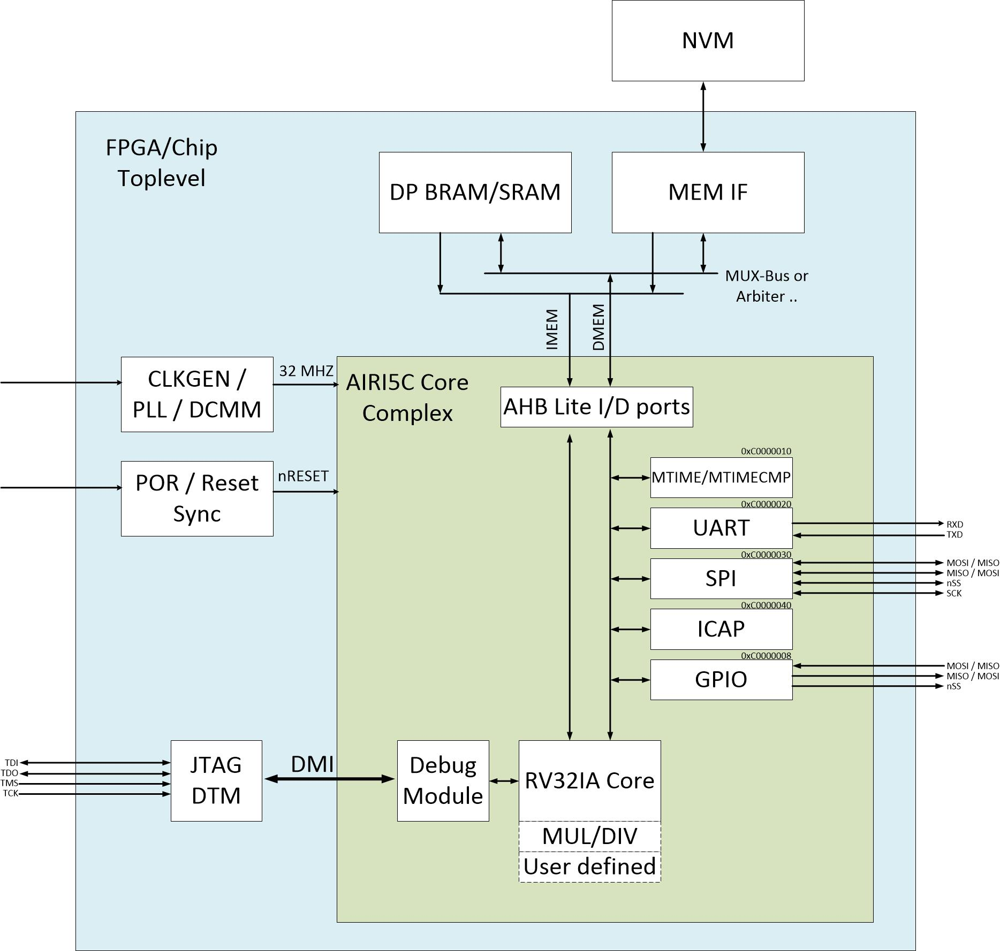

   Fig. 2: Block diagram of the AIRISC Core Complex

|

Configuration
-------------
All configurable parameters, such as the base address of peripherals or the activation of
instruction set extensions are applied in the file ``src/airi5c_arch_options.vh``.

List of AIRISC Core Complex top level ports
-------------------------------------------
The following table lists ports of the AIRISC top level module.

Tab. 2: Ports of the AIRISC top level module

+------------------+-------------------+------------------------------------------------------------------------------------------+
| direction        | symbol            | description                                                                              |
+==================+===================+==========================================================================================+
| ``input``        | ``clk``           | System clock input                                                                       |
+------------------+-------------------+------------------------------------------------------------------------------------------+
| ``input``        | ``nreset``        | Asynchronous, low active reset                                                           |
+------------------+-------------------+------------------------------------------------------------------------------------------+
| ``input``        | ``ext_interrupt`` | external interrupt(s)                                                                    |
+------------------+-------------------+------------------------------------------------------------------------------------------+
| ``input``        | ``tck``           | JTAG TCK                                                                                 |
+------------------+-------------------+------------------------------------------------------------------------------------------+
| ``input``        | ``tms``           | JTAG TMS                                                                                 |
+------------------+-------------------+------------------------------------------------------------------------------------------+
| ``input``        | ``tdi``           | JTAG TDI                                                                                 |
+------------------+-------------------+------------------------------------------------------------------------------------------+
| ``output``       | ``tdo``           | JTAG TDO                                                                                 |
+------------------+-------------------+------------------------------------------------------------------------------------------+
| ``output[31:0]`` | ``imem_haddr``    | Instruction memory address                                                               |
+------------------+-------------------+------------------------------------------------------------------------------------------+
| ``output``       | ``imem_hwrite``   | Instruction memory write enable (normally 0)                                             |
+------------------+-------------------+------------------------------------------------------------------------------------------+
| ``output[2:0]``  | ``imem_hsize``    | Size of an instruction memory data access (normally 4 byte)                              |
+------------------+-------------------+------------------------------------------------------------------------------------------+
| ``output[2:0]``  | ``imem_hburst``   | AHB-Lite burst (not supported --> constantly 0)                                          |
+------------------+-------------------+------------------------------------------------------------------------------------------+
| ``output``       | ``imem_hmastlock``| AHB-Lite master lock (not supported --> constantly 0)                                    |
+------------------+-------------------+------------------------------------------------------------------------------------------+
| ``output[3:0]``  | ``imem_hprot``    | AHB-Lite protection (not supported --> constantly 0)                                     |
+------------------+-------------------+------------------------------------------------------------------------------------------+
| ``output[1:0]``  | ``imem_htrans``   | AHB-Lite transaction (b10 at new access, b00 otherwise)                                  |
+------------------+-------------------+------------------------------------------------------------------------------------------+
| ``output[31:0]`` | ``imem_hwdata``   | Write data CPU --> instruction memory (normally 0)                                       |
+------------------+-------------------+------------------------------------------------------------------------------------------+
| ``output[31:0]`` | ``imem_hrdata``   | Read data instruction memory --> CPU                                                     |
+------------------+-------------------+------------------------------------------------------------------------------------------+
| ``input``        | ``imem_hready``   | AHB-Lite ready (0 --> processor stalled, 1 --> memory ready for new data)                |
+------------------+-------------------+------------------------------------------------------------------------------------------+
| ``input``        | ``imem_hresp``    | AHB-Lite response (not supported --> constantly 0)                                       |
+------------------+-------------------+------------------------------------------------------------------------------------------+
| ``output[31:0]`` | ``dmem_haddr``    | Address data memory                                                                      | 
+------------------+-------------------+------------------------------------------------------------------------------------------+
| ``output``       | ``dmem_hwrite``   | Write enable data memory (0 --> read access, 1 --> write access)                         |
+------------------+-------------------+------------------------------------------------------------------------------------------+
| ``output[2:0]``  | ``dmem_hsize``    | Data access size (0 --> byte, 1 --> halfword, 2 --> word)                                |
+------------------+-------------------+------------------------------------------------------------------------------------------+
| ``output[2:0]``  | ``dmem_hburst``   | AHB-Lite burst (not supported --> constantly 0)                                          |
+------------------+-------------------+------------------------------------------------------------------------------------------+
| ``output``       | ``dmem_hmastlock``| AHB-Lite master lock (not supported --> constantly 0)                                    |
+------------------+-------------------+------------------------------------------------------------------------------------------+
| ``output[3:0]``  | ``dmem_hprot``    | AHB-Lite protection (not supported --> constantly 0)                                     |
+------------------+-------------------+------------------------------------------------------------------------------------------+
| ``output[1:0]``  | ``dmem_htrans``   | AHB-Lite transaction (b10 at new access, b00 otherwise)                                  |
+------------------+-------------------+------------------------------------------------------------------------------------------+
| ``output[31:0]`` | ``dmem_hwdata``   | Write data CPU --> data memory (normally 0)                                              |
+------------------+-------------------+------------------------------------------------------------------------------------------+
| ``output[31:0]`` | ``dmem_hrdata``   | Read data instruction memory --> CPU                                                     |
+------------------+-------------------+------------------------------------------------------------------------------------------+
| ``input``        | ``dmem_hready``   | AHB-Lite ready (0 --> processor stalled, 1 --> memory ready for new data)                |
+------------------+-------------------+------------------------------------------------------------------------------------------+
| ``input``        | ``dmem_hresp``    | AHB-Lite response (nor supported --> constantly 0)                                       |
+------------------+-------------------+------------------------------------------------------------------------------------------+
| ``output[7:0]``  | ``oGPIO_D``       | Outputs for GPIO pins                                                                    |
+------------------+-------------------+------------------------------------------------------------------------------------------+
| ``output[7:0]``  | ``oGPIO_EN``      | GPIO output enable                                                                       |
+------------------+-------------------+------------------------------------------------------------------------------------------+
| ``input[7:0]``   | ``iGPIO_I``       | Inputs for GPIO Pins                                                                     |
+------------------+-------------------+------------------------------------------------------------------------------------------+
| ``output``       | ``oUART_RX``      | UART output (RX of the external system)                                                  |
+------------------+-------------------+------------------------------------------------------------------------------------------+
| ``input``        | ``iUART_TX``      | UART input (TX of the external system)                                                   | 
+------------------+-------------------+------------------------------------------------------------------------------------------+
| ``output``       | ``oSPI1_MOSI``    | SPI master out slave in                                                                  |
+------------------+-------------------+------------------------------------------------------------------------------------------+
| ``output``       | ``oSPI1_SCLK``    | SPI clock                                                                                |
+------------------+-------------------+------------------------------------------------------------------------------------------+
| ``output``       | ``oSPI1_NSS``     | SPI slave select (low active)                                                            |
+------------------+-------------------+------------------------------------------------------------------------------------------+
| ``input``        | ``iSPI1_MISO``    | SPI master in slave out                                                                  |
+------------------+-------------------+------------------------------------------------------------------------------------------+
| ``output``       | ``debug_out``     | Debugging output for simulations                                                         |
+------------------+-------------------+------------------------------------------------------------------------------------------+

Instruction set extensions 
--------------------------
The standard configuration contains the ISA extensions ``M`` and ``C``. All extensions can be
activated and deactivated in the corresponding configuration file to optimize for are and
current consumption.

E extension, reduced register set
^^^^^^^^^^^^^^^^^^^^^^^^^^^^^^^^^
A substantial amount of are consumption is caused by the general purpose registers (GPR).
The number of GPR can be reduced from 32 to 16 for extreme area critical applications, e.g.
when the AIRISC core simply replaced the implementation of a state machine (FSM). Additionally,
some optional control and status registers (CSR) are deactivated when applying the E extension.

C extension, compressed instructions
^^^^^^^^^^^^^^^^^^^^^^^^^^^^^^^^^^^^
The C extension introduces 16 bit instructions and the strict demand on 32 bit alignment is
relaxed. The 16 bit compressed instructions are decoded to their 32 bit equivalent in the first
pipeline stage. For correct operation, the used memory has to support 32 bit read accesses with
16 bit alignment.

M extension, harware multiplier/divider
^^^^^^^^^^^^^^^^^^^^^^^^^^^^^^^^^^^^^^^^
The M extensions provides a hardware-based integer multiplier and divider.

F extension, floating-point unit
^^^^^^^^^^^^^^^^^^^^^^^^^^^^^^^^
The RISC-V F ISa extensions adds a full-scale IEEE754-complaint floating-point unit to the processor core.

Standard peripherals
--------------------
The AIRISC Core Complex comprises a set of standard peripherals that are controlled via memory
mapped registers. These are described in the following sections.

TIMER1 - MTIME Compliant Timer - 0xC0000100
^^^^^^^^^^^^^^^^^^^^^^^^^^^^^^^^^^^^^^^^^^^

+----------------+------------------+--------+---------+--------------------------------------+
| Address        | Name             | Width  | Access  | Description                          | 
+================+==================+========+=========+======================================+
| ``0xC0000100`` | TIMEL            |   32   |   R/W   | 64 Bit Timer Register (LSB)          |
+----------------+------------------+--------+---------+--------------------------------------+
| ``0xC0000104`` | TIMEH            |   32   |   R/W   | 64 Bit Timer Reigster (MSB)          |
+----------------+------------------+--------+---------+--------------------------------------+
| ``0xC0000108`` | TIMECMPL         |   32   |   R/W   | 64 Bit Timer Compare Register (LSB)  |
+----------------+------------------+--------+---------+--------------------------------------+
| ``0xC000010C`` | TIMECMPH         |   32   |   R/W   | 64 Bit Timer Compare Register (MSB)  |
+----------------+------------------+--------+---------+--------------------------------------+

The timer consists of a 64 bit counter (MTIMEH/MTIMEL) and a 64 bit compare register
(MTIMECMPH/MTIMECMPL). The counter is incremented with every system clock. As soon and as long
as the content of the counter is greater or equal to the timer compare register a timer interrupt
is triggered. An interrupt will never be triggered if the timer compare register is set to
``0x00000000_00000000``.

The timer is often used to implement a scheduler for simple multi-threading or multi-tasking.

UART
^^^^

Summary
'''''''

Acting as a peripheral, the UART module provides serial communication capabilities to the AIRISC
processor. After a complete redesign, this Module now supports the following features:

*	AHB-Lite interface
*	Separate registers for control, RX and TX status, all with set/clear access capability
*	configurable and independent RX and TX fifo size (1 – 256 frames)
*	configurable number of data bits (5, 6, 7, 8, 9)
*	configurable parity settings (none, odd, even)
*	configurable number of stop bits (1, 1.5, 2)
*	support for hardware flow control (rts/cts)
*	support for default and none default baud rates
*	accessible RX and TX FIFO fill levels
*	configurable and independent watermark settings for RX and TX FIFO fill level with interrupt generation
*	error detection
*	extensive interrupt capabilities

Parameters
''''''''''

These parameters have to be set at compile time, they cannot be changed at runtime.

+----------------+-------------+----------------------------------------------------------------------------------------------------------------+
| Parameter      | Default     | Description                                                                                                    |
+================+=============+================================================================================================================+
| BASE_ADDR      | 0xC0000200  | Base address of the UART module, the addresses of all registers are increments of 4 beginning at this address  |
+----------------+-------------+----------------------------------------------------------------------------------------------------------------+
| TX_ADDR_WIDTH  | 5           | Address width of the TX FIFO, defining the max size of the TX FIFO (size=2^width)                              |
+----------------+-------------+----------------------------------------------------------------------------------------------------------------+
| RX_ADDR_WIDTH  | 5           | Address width of the RX FIFO, defining the max size of the RX FIFO (size=2^width)                              |
+----------------+-------------+----------------------------------------------------------------------------------------------------------------+

Registers
'''''''''

The UART module includes the following 10 32-bit data, control and status registers, which can be
accessed via AHB-Lite interface. In the old processor design, the address space of each peripheral
was restricted to 4 32-bit words. With the introduction of the new UART module this number has been
increased to 64. Remember that the base address of each peripheral has been changed accordingly and
need to be changed in your programs too!

Reserved fields are hardwired to zero, writing to those fields has no effect. Errors are normally
set at the end of the particular frame where the error occurred. The only exceptions are TX overflow
error and RX underflow error, which are set immediately. Once set, all error stay set as long as
they get reset manually.

+--------------------------------+------------------+-----------------------------------------------------------------------------------------------------------------------+
| Address                        | Type             | Description                                                                                                           |
+================================+==================+=======================================================================================================================+
| BASE_ADDR + 0x00 (0xC0000200)  | DATA             | Write access writes to TX FIFO, read access reads from RX FIFO                                                        |
+--------------------------------+------------------+-----------------------------------------------------------------------------------------------------------------------+
| BASE_ADDR + 0x04 (0xC0000204)  | Ctrl reg         | This register contains all communication settings, such as data bits, parity, stop bits, flow control and baud rate   |
+--------------------------------+------------------+-----------------------------------------------------------------------------------------------------------------------+
| BASE_ADDR + 0x08 (0xC0000208)  | Ctrl reg set     | Writing to this register automatically sets the specified bits in ctrl reg                                            |
+--------------------------------+------------------+-----------------------------------------------------------------------------------------------------------------------+
| BASE_ADDR + 0x0C (0xC000020C)  | Ctrl reg clr     | Writing to this register automatically clears the specified bits in ctrl reg                                          |
+--------------------------------+------------------+-----------------------------------------------------------------------------------------------------------------------+
| BASE_ADDR + 0x10 (0xC0000210)  | TX stat reg      | This register contains the TX status, such as TX FIFO size, errors and interrupt enables                              |
+--------------------------------+------------------+-----------------------------------------------------------------------------------------------------------------------+
| BASE_ADDR + 0x14 (0xC0000214)  | TX stat reg set  | Writing to this register automatically sets the specified bits in TX stat reg                                         |
+--------------------------------+------------------+-----------------------------------------------------------------------------------------------------------------------+
| BASE_ADDR + 0x18 (0xC0000218)  | TX stat reg clr  | Writing to this register automatically clears the specified bits in TX stat reg                                       |
+--------------------------------+------------------+-----------------------------------------------------------------------------------------------------------------------+
| BASE_ADDR + 0x1C (0xC000021C)  | RX stat reg      | This register contains the RX status, such as RX FIFO size, errors and interrupt enables                              |
+--------------------------------+------------------+-----------------------------------------------------------------------------------------------------------------------+
| BASE_ADDR + 0x20 (0xC0000220)  | RX stat reg set  | Writing to this register automatically sets the specified bits in RX stat reg                                         |
+--------------------------------+------------------+-----------------------------------------------------------------------------------------------------------------------+
| BASE_ADDR + 0x24 (0xC0000224)  | RX stat reg clr  | Writing to this register automatically clears the specified bits in RX stat reg                                       |
+--------------------------------+------------------+-----------------------------------------------------------------------------------------------------------------------+

Control Register
''''''''''''''''

+-------+---------+--------------------------------------------------------+
| Bits  | Access  | Description                                            |
+=======+=========+========================================================+
| 31:29 | rw      | Number of data bits (0b000: 5, …, 0b011: 8, 0b100: 9)  |
+-------+---------+--------------------------------------------------------+
| 28:27 | rw      | Parity setting (0b00: none, 0b01: even, 0b10: odd)     |
+-------+---------+--------------------------------------------------------+
| 26:25 | rw      | Number of stop bits (0b00: 1, 0b01: 1.5, 0b10: 2)      |
+-------+---------+--------------------------------------------------------+
| 24    | rw      | Flow control (0b0: none, 0b1: rts/cts)                 |
+-------+---------+--------------------------------------------------------+
| 23:0  | rw      | Number of clock cycles per bit (c_bit=f_osc/BAUD)      |
+-------+---------+--------------------------------------------------------+

If the number of data bits is set to 9, the number of stop bits is automatically set to 1 and parity
is set to none. When writing an invalid value (e.g. 0b101: 10 data bits), the particular field is set
to the highest possible value instead. A set access resulting in an invalid value is ignored.
Modifications of the bits in the control register come into effect immediately. Make sure that there
is no active communication when modifying this register, otherwise data loss and communication errors
can occur. The default communication settings are:

*	Data bits: 8
*	Parity: none
*	Stop bits: 1
*	Flow control: none
*	Baud rate: 9600 (at 32 MHz)

TX Status Register
''''''''''''''''''

+-------+---------+---------------------------------------------+
| Bits  | Access  | Description                                 |
+=======+=========+=============================================+
| 31    | rw      | Clear TX FIFO                               |
+-------+---------+---------------------------------------------+
| 30:27 | r       | Reserved                                    |
+-------+---------+---------------------------------------------+
| 26    | rw      | TX overflow error interrupt enable          |
+-------+---------+---------------------------------------------+
| 25    | rw      | TX watermark reached interrupt enable       |
+-------+---------+---------------------------------------------+
| 24    | rw      | TX empty interrupt enable                   |
+-------+---------+---------------------------------------------+
| 23:20 | r       | reserved                                    |
+-------+---------+---------------------------------------------+
| 19    | rw      | TX overflow error (write to full TX FIFO)   |
+-------+---------+---------------------------------------------+
| 18    | r       | TX fill level \leq TX watermark             |
+-------+---------+---------------------------------------------+
| 17    | r       | TX empty                                    |
+-------+---------+---------------------------------------------+
| 16    | r       | TX full                                     |
+-------+---------+---------------------------------------------+
| 15:8  | r       | TX watermark                                |
+-------+---------+---------------------------------------------+
| 7:0   | r       | TX fill level                               |
+-------+---------+---------------------------------------------+

RX Status Register
''''''''''''''''''

+-------+---------+------------------------------------------------------------+
| Bits  | Access  | Description                                                |
+=======+=========+============================================================+
| 31    | rw      | Clear RX FIFO                                              |
+-------+---------+------------------------------------------------------------+
| 30    | rw      | RX frame error interrupt enable                            |
+-------+---------+------------------------------------------------------------+
| 29    | rw      | RX parity error interrupt enable                           |
+-------+---------+------------------------------------------------------------+
| 28    | rw      | RX noise error interrupt enable                            |
+-------+---------+------------------------------------------------------------+
| 27    | rw      | RX underflow error interrupt enable                        |
+-------+---------+------------------------------------------------------------+
| 26    | rw      | RX overflow error interrupt enable                         |
+-------+---------+------------------------------------------------------------+
| 25    | rw      | RX watermark reached interrupt enable                      |
+-------+---------+------------------------------------------------------------+
| 24    | rw      | RX  full interrupt enable                                  |
+-------+---------+------------------------------------------------------------+
| 23    | rw      | RX frame error (no stop bit detected)                      |
+-------+---------+------------------------------------------------------------+
| 22    | rw      | RX parity error (parity received \neq calculated)          |
+-------+---------+------------------------------------------------------------+
| 21    | rw      | RX noise error (samples taken from one bit differ)         |
+-------+---------+------------------------------------------------------------+
| 20    | rw      | RX underflow error (read from empty RX FIFO)               |
+-------+---------+------------------------------------------------------------+
| 19    | rw      | RX overflow error (received data while RX FIFO was full)   |
+-------+---------+------------------------------------------------------------+
| 18    | r       | RX fill level \geq RX watermark                            |
+-------+---------+------------------------------------------------------------+
| 17    | r       | RX empty                                                   |
+-------+---------+------------------------------------------------------------+
| 16    | r       | RX full                                                    |
+-------+---------+------------------------------------------------------------+
| 15:8  | rw      | RX watermark                                               |
+-------+---------+------------------------------------------------------------+
| 7:0   | r       | RX fill level                                              |
+-------+---------+------------------------------------------------------------+

Interrupts
''''''''''

The UART module supports several interrupts, which are stated in the TX and RX status register.
All interrupts are disabled by default and have to be enabled manually if desired. Besides the
individual interrupt signals, there is also a special signal "int_any" available at the port of
this module which is set whenever at least one interrupt has occurred. Some interrupt signals are
connected to the specific error signals. In this case an interrupt service routine has to reset the
specific error flag, otherwise the interrupt will fire again and again.

Functionality
'''''''''''''

Transmitting data can be achieved writing to the DATA address, which effectively writes to the TX FIFO.
As long as the TX FIFO is not full, new data can be written to it immediately in a row. The UART
module automatically reads the data in the TX FIFO and transmits it via the TX pin. When writing
to the TX FIFO while it is full, the data written to it is lost and the TX overflow error is set.
Incoming data via the RX pin is automatically written to the RX FIFO, which can be read from by
reading from the DATA address. As long as the RX FIFO is not full, data can be received. As soon
as the RX FIFO is full, any incoming data is lost and the RX overflow error is set. The data in the
RX FIFO (as well as the TX FIFO) never gets overwritten. In order to free FIFO memory, data has to
be read.
Each bit of incoming data is sampled 3 times at and around its timed midpoint. If the samples differ,
the noise error is set at the end of the specific frame.

Flow Control
''''''''''''

The UART module supports rts/cts hardware flow control. Rts is an output of the receiver called ready
to send which is connected to the cts input of the transmitter called clear to send (and vice versa).
Set to high, rts signals the transmitter, that its RX FIFO is not full and new data can be received.
As soon as the RX FIFO is full, rts is set to low, signaling the transmitter that it has to stop transmission.
To prevent data loss, rts is already set to low, when there is only space for 4 more frames in the RX FIFO.

The rts and cts pins are currently not connected in our FPGA designs!

GPIO
^^^^
The GPIO module has a configurable width with a default value of 8 bit. Separate signals are available
for data output, data input and activation of the pad driver to support the integration into ASIC
designs. Tab. 6 shows a list of registers available through the GPIO module. Read- and write access
is done through through GPIODATA. The byte value is put on the processor bus when a read access is
issued in the topmodule ``iGPIO_I``. When a write access is issued, the corresponding value is read
from the processor bus and written to ``oGPIO_D`` of the top module. Write access to GPIOEN do only
have an effect on the output ``oGPIO_EN``. The bi-directionality of an IO pin can be realized this
way within the higher-ranking hierarchy (e.g. inside an FPGA by connection of an ``inout`` or inside
an ASIC by routing to a appropriate IO pad).

Tab. 6: Register of the  GPIO module.

+----------------+------------------+--------+---------+--------------------------------------+
| Address        | Name             | Width  | Access  | Description                          | 
+================+==================+========+=========+======================================+
| ``0xC0000400`` | DATA             | 32(8)* |   R/W   | GPIO Data I/O                        |
+----------------+------------------+--------+---------+--------------------------------------+
| ``0xC0000404`` | EN               | 32(8)* |   R/W   | GPIO Output Enable                   |
+----------------+------------------+--------+---------+--------------------------------------+

ICAP
^^^^
The ICAP peripheral offers a method to encapsule the configuration interface for FPGAs which allow
the dynamic partial reconfiguration during operation (e.g. Xilinx Dynamic Function Exchange).
Partial bitstreams can be written to the address of the ICAP peripheral by the AIRISC processor to
perform a partial reconfiguration of an FPGA. The ICAP module is currently an experimental feature
and will probably undergo significant changes in future developments.

+----------------+------------------+--------+---------+--------------------------------------+
| Address        | Name             | Width  | Access  | Description                          | 
+================+==================+========+=========+======================================+
| ``0xC0000500`` | CTRL             |   32   |   R/W   | ICAP Status and control              |
+----------------+------------------+--------+---------+--------------------------------------+
| ``0xC0000504`` | DATAIN           |   32   |   W     | ICAP Bitstream input                 |
+----------------+------------------+--------+---------+--------------------------------------+
| ``0xC0000508`` | DATAOUT          |   32   |   R     | ICAP Read configuration output       |
+----------------+------------------+--------+---------+--------------------------------------+

+-------------------------------+
| CTRL (Address: 0xC0000500)    |
+==================+============+
|       31:1       |     0      |
+------------------+------------+
|        --        |    R/W     |
+------------------+------------+
|     reserved     |  ICAP_LOCK |
+------------------+------------+

If the ``ICAP_LOCK`` bit is set (1), the access to the PCPI interface within the pipeline is locked. 
This prevents unknown states to occur when reconfiguring a partition connected to the PCPI interface 
during runtime.

SPI
^^^

Summary
'''''''

Acting as a peripheral, the SPI module provides fast serial communication capabilities to the AIRISC
processor. After a complete redesign, this Module now supports the following features:

*	AHB-Lite interface
*	Separate registers for control, RX and TX status, all with set/clear access capability
*	configurable RX/TX FIFO size (1 – 256 frames)
*	configurable number of data bits
*	master and slave support
*	4 slave select pins
*	Full asynchronous Slave design
*	accessible RX and TX FIFO fill levels
*	configurable and independent watermark settings for RX and TX FIFO fill level with interrupt generation
*	error detection
*	extensive interrupt capabilities

Parameters
''''''''''

These parameters have to be set at synthesis, they cannot be changed at runtime.

+-----------------+-------------+---------------------------------------------------------------------------------------------------------------------------------------------------------------------------------------------+
| Parameter       | Default     | Description                                                                                                                                                                                 |
+=================+=============+=============================================================================================================================================================================================+
| BASE_ADDR       | 0xC0000500  | Base address of the SPI module, the addresses of all registers are increments of 4 beginning at this address.                                                                               |
+-----------------+-------------+---------------------------------------------------------------------------------------------------------------------------------------------------------------------------------------------+
| RESET_CONF      | 1           | Defines whether the module acts as a master (1) or slave (0) after reset.                                                                                                                   |
+-----------------+-------------+---------------------------------------------------------------------------------------------------------------------------------------------------------------------------------------------+
| FIXED_CONF      | 0           | Disables the ability to change the master/slave configuration at runtime and thus allows the unwanted part to be synthesized away. If this bit is 1, the module always uses its RESET_CONF. |
+-----------------+-------------+---------------------------------------------------------------------------------------------------------------------------------------------------------------------------------------------+
| ADDR_WIDTH      | 2           | Address width of the TX/RX FIFO, defining the max fill level (size=2^width).                                                                                                                |
+-----------------+-------------+---------------------------------------------------------------------------------------------------------------------------------------------------------------------------------------------+
| ADDR_WIDTH      | 8           | Defines the word the word length and accordingly the number of bits in the internal TX/RX shift registers.                                                                                  |
+-----------------+-------------+---------------------------------------------------------------------------------------------------------------------------------------------------------------------------------------------+

Registers
'''''''''

The SPI module includes the following 10 32-bit data, control and status registers,
which can be accessed via AHB-Lite interface.

+-------------------------------------+------------------+---------------------------------------------------------------------------------------------------------------------------------------+
| Address                             | Type             | Description                                                                                                                           |
+=====================================+==================+=======================================================================================================================================+
| BASE_ADDR + 0x00 (SPI0: 0xC0000400) | DATA             | Write access writes to TX FIFO, read access reads from RX FIFO                                                                        |
+-------------------------------------+------------------+---------------------------------------------------------------------------------------------------------------------------------------+
| BASE_ADDR + 0x04 (SPI0: 0xC0000404) | Ctrl reg         | This register contains all communication settings, such as clock divider, polarity phase, slave select and master/slave configuration |
+-------------------------------------+------------------+---------------------------------------------------------------------------------------------------------------------------------------+
| BASE_ADDR + 0x08 (SPI0: 0xC0000408) | Ctrl reg set     | Writing to this register automatically sets the specified bits in ctrl reg                                                            |
+-------------------------------------+------------------+---------------------------------------------------------------------------------------------------------------------------------------+
| BASE_ADDR + 0x0C (SPI0: 0xC000040C) | Ctrl reg clr     | Writing to this register automatically clears the specified bits in ctrl reg                                                          |
+-------------------------------------+------------------+---------------------------------------------------------------------------------------------------------------------------------------+
| BASE_ADDR + 0x10 (SPI0: 0xC0000410) | TX stat reg      | This register contains the TX status, such as TX FIFO fill level, errors and interrupt enables                                        |
+-------------------------------------+------------------+---------------------------------------------------------------------------------------------------------------------------------------+
| BASE_ADDR + 0x14 (SPI0: 0xC0000414) | TX stat reg set  | Writing to this register automatically sets the specified bits in TX stat reg                                                         |
+-------------------------------------+------------------+---------------------------------------------------------------------------------------------------------------------------------------+
| BASE_ADDR + 0x18 (SPI0: 0xC0000418) | TX stat reg clr  | Writing to this register automatically clears the specified bits in TX stat reg                                                       |
+-------------------------------------+------------------+---------------------------------------------------------------------------------------------------------------------------------------+
| BASE_ADDR + 0x1C (SPI0: 0xC000041C) | RX stat reg      | This register contains the RX status, such as RX FIFO fill level, errors and interrupt enables                                        |
+-------------------------------------+------------------+---------------------------------------------------------------------------------------------------------------------------------------+
| BASE_ADDR + 0x20 (SPI0: 0xC0000420) | RX stat reg set  | Writing to this register automatically sets the specified bits in RX stat reg                                                         |
+-------------------------------------+------------------+---------------------------------------------------------------------------------------------------------------------------------------+
| BASE_ADDR + 0x24 (SPI0: 0xC0000424) | RX stat reg clr  | Writing to this register automatically clears the specified bits in RX stat reg                                                       |
+-------------------------------------+------------------+---------------------------------------------------------------------------------------------------------------------------------------+

Control Register
''''''''''''''''

+-------+---------+---------------------------------------------------------------------------------+
| Bits  | Access  | Description                                                                     |
+=======+=========+=================================================================================+
| 31:25 | r       | reserved                                                                        |
+-------+---------+---------------------------------------------------------------------------------+
| 24    | rw      | Output enable                                                                   |
+-------+---------+---------------------------------------------------------------------------------+
| 23:22 | r       | reserved                                                                        |
+-------+---------+---------------------------------------------------------------------------------+
| 21    | r       | FIXED_CONF                                                                      |
+-------+---------+---------------------------------------------------------------------------------+
| 20    | r       | RESET_CONF                                                                      |
+-------+---------+---------------------------------------------------------------------------------+
| 19:17 | rw      | reserved                                                                        |
+-------+---------+---------------------------------------------------------------------------------+
| 16    | rw      | Defines whether the device is master (1) or slave (0)                           |
+-------+---------+---------------------------------------------------------------------------------+
| 15    | r       | reserved                                                                        |
+-------+---------+---------------------------------------------------------------------------------+
| 14    | rw      | slave select pulse mode enable                                                  |
+-------+---------+---------------------------------------------------------------------------------+
| 13    | rw      | Defines whether slave select is driven by hardware (0) or software (1)          |
+-------+---------+---------------------------------------------------------------------------------+
| 12    | rw      | software slave select (only used if bit 13 is set)                              |
+-------+---------+---------------------------------------------------------------------------------+
| 11:10 | r       | reserved                                                                        |
+-------+---------+---------------------------------------------------------------------------------+
| 9:8   | rw      | Active slave select (only used in master mode)                                  |
+-------+---------+---------------------------------------------------------------------------------+
| 7:6   | r       | reserved                                                                        |
+-------+---------+---------------------------------------------------------------------------------+
| 5     | rw      | Clock polarity                                                                  |
+-------+---------+---------------------------------------------------------------------------------+
| 4     | rw      | Clock phase                                                                     |
+-------+---------+---------------------------------------------------------------------------------+
| 3:0   | rw      | Clock divider (clk_div=2^(x+1))                                                 |
+-------+---------+---------------------------------------------------------------------------------+

TX Status Register
''''''''''''''''''

+-------+---------+----------------------------------------------------+
| Bits  | Access  | Description                                        |
+=======+=========+====================================================+
| 31    | rw      | tx_ena                                             |
+-------+---------+----------------------------------------------------+
| 30:28 | r       | reserved                                           |
+-------+---------+----------------------------------------------------+
| 27    | rw      | TX ready interrupt enable                          |
+-------+---------+----------------------------------------------------+
| 26    | rw      | TX overflow error interrupt enable                 |
+-------+---------+----------------------------------------------------+
| 25    | rw      | TX watermark reached interrupt enable              |
+-------+---------+----------------------------------------------------+
| 24    | rw      | TX empty interrupt enable                          |
+-------+---------+----------------------------------------------------+
| 23:21 | r       | reserved                                           |
+-------+---------+----------------------------------------------------+
| 20    | rw      | TX ready                                           |
+-------+---------+----------------------------------------------------+
| 19    | rw      | TX overflow error (write access when FIFO is full) |
+-------+---------+----------------------------------------------------+
| 18    | r       | TX fill level \leq TX watermark                    |
+-------+---------+----------------------------------------------------+
| 17    | r       | TX empty                                           |
+-------+---------+----------------------------------------------------+
| 16    | r       | TX full                                            |
+-------+---------+----------------------------------------------------+
| 15:8  | r       | TX watermark                                       |
+-------+---------+----------------------------------------------------+
| 7:0   | rw      | TX fill level                                      |
+-------+---------+----------------------------------------------------+

RX Status Register
''''''''''''''''''

+-------+---------+----------------------------------------------------------+
| Bits  | Access  | Description                                              |
+=======+=========+==========================================================+
| 31    | rw      | RX ignore                                                |
+-------+---------+----------------------------------------------------------+
| 30:28 | r       | reserved                                                 |
+-------+---------+----------------------------------------------------------+
| 27    | rw      | RX underflow error interrupt enable                      |
+-------+---------+----------------------------------------------------------+
| 26    | rw      | RX overflow error interrupt enable                       |
+-------+---------+----------------------------------------------------------+
| 25    | rw      | RX watermark reached interrupt enable                    |
+-------+---------+----------------------------------------------------------+
| 24    | rw      | RX full interrupt enable                                 |
+-------+---------+----------------------------------------------------------+
| 23:21 | r       | reserved                                                 |
+-------+---------+----------------------------------------------------------+
| 20    | rw      | RX underflow error (read from empty RX FIFO)             |
+-------+---------+----------------------------------------------------------+
| 19    | rw      | RX overflow error (received data while RX FIFO was full) |
+-------+---------+----------------------------------------------------------+
| 18    | r       | RX fill level \geq RX watermark                          |
+-------+---------+----------------------------------------------------------+
| 17    | r       | RX empty                                                 |
+-------+---------+----------------------------------------------------------+
| 16    | r       | RX full                                                  |
+-------+---------+----------------------------------------------------------+
| 15:8  | rw      | RX watermark                                             |
+-------+---------+----------------------------------------------------------+
| 7:0   | r       | RX fill level                                            |
+-------+---------+----------------------------------------------------------+

Reserved fields are hardwired to zero, writing to those fields has no effect.
Once set, all errors stay set as long as they get reset manually.

Interrupts
''''''''''

The SPI module supports several interrupts, which are stated in the TX and RX status registers.
All interrupts are disabled by default and have to be enabled manually if desired. Besides the
individual interrupt signals, there is also a special signal "int_any" available at the port of
this module which is set whenever at least one interrupt has occurred. Some interrupt signals are
connected to the specific error signals. In this case an interrupt service routine has to reset
the specific error flag, otherwise the interrupt will fire again and again.

Functionality
'''''''''''''

Transmitting data can be achieved writing to the DATA address, which effectively writes to the TX
FIFO. As long as the TX FIFO is not full, new data can be written to it immediately in a row. The
SPI module then reads the data in the TX FIFO automatically and transmits it via the mosi pin in
master or the miso pin in slave mode. Transactions are initiated by the master. Data written to the
TX FIFO of the slave device is hold, until data from the master is received, meaning, for each frame
sent, one frame is received. If the TX FIFO of the slave is empty, zeros are transmitted instead.
Incoming data is automatically written to the RX FIFO, which can be read from by reading from the
DATA address. To ignore any incoming data, the RX ignore flag can be set. As long as the RX FIFO
is not full, data can be received. As soon as the RX FIFO is full, any incoming data is lost and
the RX overflow error is set. Due to the asynchronous slave design, data transmission is always
triggered on clock edges of the master clock, allowing high data rates and an idle slave clock.
The very first byte sent in slave mode is always 0x00, due to clock domain crossing.

The board support package of the AIRI5C contains an extensive API with every function supported
by the SPI module.

TRNG - True-Random Number Generator
^^^^^^^^^^^^^^^^^^^^^^^^^^^^^^^^^^^

The TRNG module provides true-random numbers obtained from a physical entropy source. The TRNG core
instantiates the `neoTRNG (GitHub) <https://github.com/stnolting/neoTRNG>` module, which implements
a technology-agnostic physical entropy source based on ring oscillators (combinatorial loops!).
This module can be synthesized for any (FPGA) target technology. See the neoTRNG GitHub page for more
information.

Make sure to clone the project recursively as the TRNG core is included as (Git) submodule.

slow entropy source.
+----------------+------------------+--------+---------+--------------------------------------+
| Address        | Name             | Width  | Access  | Description                          | 
+================+==================+========+=========+======================================+
| ``0xC0000800`` | TRNG_CTRL        |   32   |   R/W   | Control and data register            |
+----------------+------------------+--------+---------+--------------------------------------+

Control and Data Register Bits
''''''''''''''''''''''''''''''

+-------+--------+---------------------------------------------------------------------------------------------------------+
| Bits  | Access | Description                                                                                             |
+=======+========+=========================================================================================================+
| 31    | r/-    | Valid bit, set when random data byte is valid, auto-clears when reading                                 |
+-------+--------+---------------------------------------------------------------------------------------------------------+
| 30    | r/w    | TRNG enable; clearing this bit will reset the entropy source and will also clear the random pool (FIFO) |
+-------+--------+---------------------------------------------------------------------------------------------------------+
| 29    | r/w    | Simulation notifier: if this bit is set the AIRISC is being simulated (see note)                        |
+-------+--------+---------------------------------------------------------------------------------------------------------+
| 28:8  | r/-    | reserved, read as zero                                                                                  |
+-------+--------+---------------------------------------------------------------------------------------------------------+
| 7:0   | r/-    | Random data byte, valid if bit 31 is set - otherwise the data byte is forced to all-zero                |
+-------+--------+---------------------------------------------------------------------------------------------------------+

The module provides a tranparent data FIFO with 32 entries to gather a "pool" of random data from
the realtive slow entropy source. This FIFO can be cleared at any time by disabling and re-enabling
the TRNG using bit 30 of the control register.

The TRNG provides a simulation mode that allows to provide "random" data even in rtl simulation. Note that
for the simulation mode the ring-osciallator-based entropy cells are automatically removed and replaced by
a plain "pseudo-random" generator based on a small LFSR (which provides poor random data quality!).

Simulation mode is automatically enabled during HDL source elaboration. Bit 29 of the TRNG control register is
hardwired to 1 if simulation mode is enabled.

JTAG Debug Transport Module (DTM)
^^^^^^^^^^^^^^^^^^^^^^^^^^^^^^^^^
The RISC-V External Debug Support Standard defines a transport layer (DTM) between the debug
module and the external debugger, which converts any protocol to the internal debug module interface.
The only DTM currently supported by the GNU toolchain is a JTAG TAP. This is included in the AIRISC
code tree, but is strictly speaking not part of the AIRISC Core Complex, but is typically instantiated
at the top level of the FPGA or ASIC design and can here, in addition to communication with the Core
Complex, also take over other functions of a JTAG-TAP, e.g. for the scan test.

System-Bus
----------

AHB-Lite
^^^^^^^^
The standard bus for accessing memory and peripheral elements is AHB-Lite. The processor works as
the only master in the system. Table 11 lists the typical signals and names their respective functions.
For detailed descriptions of the signals, please refer to the `AMBA 3 AHB-Lite Protocol
Specification <https://developer.arm.com/documentation/ihi0033/a>`_.

Tab. 11: Signals within the AIRISC AHB-Lite Interface

.. list-table::
   :widths: 10 80 10
   :header-rows: 1

   * - name
     - description
     - bit width
   * - ``haddr``
     - Address requested in memory 
     - 32
   * - ``hwrite``
     - Write enable bit (write = b1, read = b0)
     - 1
   * - ``hsize``
     - Size of the data to be transferred (supported: byte (h0), halfword (h1), word (h2))
     - 3
   * - ``hburst``
     - reserved
     - 3
   * - ``hmastlock``
     - reserved
     - 1
   * - ``hprot``
     - reserved
     - 4
   * - ``htrans``
     - Transaction type (supported: idle (h0) nonsequential (h2))
     - 2
   * - ``hwdata``
     - write data CPU --> memory element
     - 32
   * - ``hrdata``
     - read data memory element --> CPU
     - 32
   * - ``hready``
     - memory element ready for data
     - 1
   * - ``hresp``
     - Response bit for signaling errors
     - 1

Fig. 3 shows the signal characteristics of the AHB-Lite bus during read and write accesses to
a memory. The memory assumed here has a latency of one clock cycle and therefore requires no
further waiting cycles for a read access. In the case of a write access, the value to be written
is not available until one clock cycle after the address has been applied, which is why the memory
requests a wait cycle of one clock cycle (highlighted on the corresponding edges a and b).
The processor's read data (hrdata) is not written with a new value until a new transaction occurs.
This can be seen at the edges c and d. 

.. figure:: gfx/AHBLite_RW_wavedrom.png
   :width: 640

Fig.3: Signal characteristics at the AHB-Lite bus.

AXI4
^^^^
For the connection of arbitrary memory units to the processor a translation from AHB-Lite to AXI4
can be done with the help of the module ``airi5c_axi_if.v``. For detailed descriptions of the
signals, please refer to the `AMBA AXI and ACE Protocol Specification
<https://developer.arm.com/documentation/ihi0022/latest>`_. The AXI4 interface is currently an
experimental feature and may be subject to significant changes in the future.

AIRISC architecture in detail
=============================

Pipeline
--------
Fig. 4 illustrates the various pipeline stages of the processor, which are discussed below.
 
|

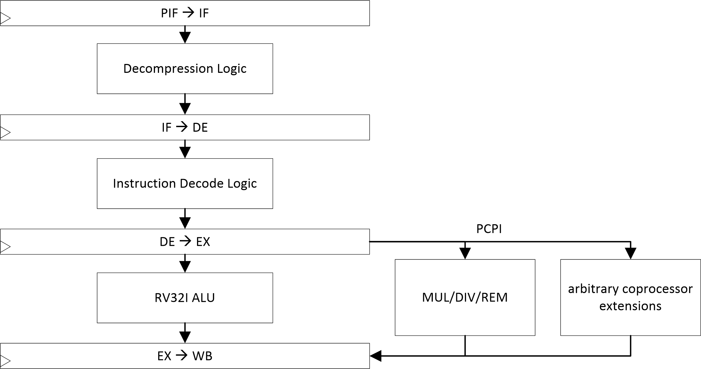

   Abb. 4: Pipeline overview

|

Instruction Prefetch and Decompression (IF)
^^^^^^^^^^^^^^^^^^^^^^^^^^^^^^^^^^^^^^^^^^^
The IF stage fetches the next instruction from the memory and handles wait cycles of the memory
or those due to pipeline stalls. The purpose of a separate IF stage is to allow the memory a full
clock cycle access time. As long as no redirect is reported by the EX stage, the IF stage
calculates the next address itself. 

Fetch and Decode Unit (DE)
^^^^^^^^^^^^^^^^^^^^^^^^^^
The DE unit decodes the instructions and generates the control signals for the EX unit or ALU.
These are then stored in the DE-EX pipeline registers, so that the EX stage/ALU has a full clock
cycle available for the calculation.

Execute Unit (EX)
^^^^^^^^^^^^^^^^^
The EX unit includes the ALU and the generation of synchronous exceptions when interrupts,
breakpoints (EBREAK) and system calls (ECALL) occur. It can be extended by additional instructions
and accelerators via the PCPI interface.

Writeback (WB)
^^^^^^^^^^^^^^
The WB stage writes results to GPR/CSR registers and - in case of load/store instructions - also
from/to the data bus. It generates breakpoint exceptions in case of single step execution and
counts the completely executed instructions. 

Control Unit (CTRL)
^^^^^^^^^^^^^^^^^^^
The CTRL unit is a cross-stage module in which the basic control of the pipeline is performed.
The main tasks of the module are the detection and interception of hazards, the stopping of the
pipeline in case of arbitrarily long latencies by a connected memory as well as the aborting of
instructions in case of exceptions, interrupts or branches. For this purpose, individual kill 
and stall signals are available for the pipeline stages, with which the pipeline can be stopped
or emptied at any point. 

PCPI-Interface
--------------
The `PCPI-Interface <https://github.com/cliffordwolf/picorv32#pico-co-processor-interface-pcpi>`_
provides a simple interface for extensions of the ALU/EX-Stage. This concerns in particular
specialized arithmetic functions. Fig. 5 illustrates an example of the timing for an interaction
with a coprocessor. 

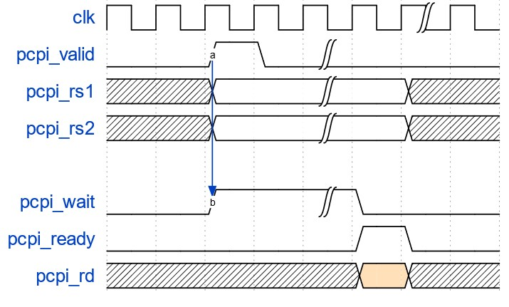

   Fig. 5: Timing diagram of the PCPI interface

|

The interface consists of the following signals::

    output        pcpi_valid    // pcpi_insn, pcpi_rs1 and pcpi_rs2 valid
    output [31:0] pcpi_insn     // requested instruktion
    output [31:0] pcpi_rs1      // register contents RS1
    output [31:0] pcpi_rs2      // register contents RS2
    input         pcpi_wr       // Operation writes data to destination register
    input  [31:0] pcpi_rd       // Data for target register
    input         pcpi_wait     // Coprocessor processes instruction
    input         pcpi_ready    // pcpi_rd and pcpi_wr valid

The input signals are shared with other modules, the output signals are linked by a wired-or.
Its timing is a possible limit to the number of instruction set extensions. 

The ``pcpi_valid`` signal indicates to the instruction set extension that the
``pcpi_insn, pcpi_rs1 and pcpi_rs2`` registers are valid. These are passed to the instruction
set extension. This in turn sets the ``pcpi_wait`` signal high, signaling that the instruction
is being processed (this must happen on the same clock as the ``pcpi_valid``). If the
``pcpi_wait`` signal is not set to ``HIGH`` after 16 clock cycles, an ``illegal_instruction``
exception is thrown. If the instruction is successfully processed, the ``pcpi_ready`` signal
is set to ``HIGH`` and the pipeline can continue. 

Instruction set extensions cannot raise exceptions and only general purpose registers can
serve as source and destination registers.

In software, instruction set extensions can be accessed by inline assembly. The following
listing represents an example: ::

    __inline__
    uint32_t __rv__bitrev_emu(uint32_t a) {
        uint32_t result;
        asm(".insn i 0x77, 0, %0, %1, 0x0"
            : "=r"(result)
            : "r"(a)
        :);
    return(result);
    }

Privilege Mode
---------------
Three privilege modes are supported: Debug mode, machine mode and user mode. The core starts after
a reset in machine mode. In the startup-file (crt0.S) the main routine "main" is started by a
preload of the EPC register with the target address and a subsequent MRET and at the same time
changed into the user mode. 

A change into the machine mode is then executed by interrupts and exceptions or explicitly by an
ECALL command.

The debug mode is activated after a software breakpoint (EBREAK), after a program step in the
single-step mode which is created by the debug module on stop request. In this mode the core is
usually in the park loop stored in the debug ROM and waits for commands from the debug module.
However, the debug mode can also be specifically activated (but not exited) from the running
program by jumping into the debug ROM.

Interrupts
----------

There are internal interrupts, which are generated in the AIRISC core complex e.g. by the timer
or the UART peripheral, as well as external ones, which are set via the EXT_INT lines of the core
complex. 

All interrupts - if they are not masked in the respective privilege level - are recognized in the
DX stage and converted into a synchronous exception, which leads to a jump to the MTVEC address
with a clock delay in the WB stage. The interrupt type is stored in the MCAUSE register.

Exceptions
----------

Exceptions occur either as a result of errors (e.g. invalid OpCodes, memory access errors), due to
EBREAK/ECALL/ERET instructions or Halt requests by the debug module. 

The RISC-V specification does not allow arithmetic exceptions. Exceptions due to errors in the ALU
therefore *do not* occur. Arithmetic exceptions such as division by zero are instead encoded using
error values.

All exceptions are generated in the EX stage, with the exception of the exception after the
complete processing of an instruction in single-step mode. This is generated in the WB stage. 

Debug Support
-------------

The core complex includes a debug module and debug transfer module for communication via JTAG.
Register accesses via the debug module are implemented as abstract instructions for both GPR and
CSR. They can be performed while the core is running and have priority over concurrent write
accesses of the core itself. Memory accesses to the system memory are implemented program
buffer-based. The debug module can write to a two-line program buffer (with implicit EBREAK
after the second instruction) and execute it with limited privileges. The second line in the
program buffer also allows bulk read/write with automatic increment of the target address.

First steps with the virtual prototype
======================================

Prerequisite for the commissioning of the virtual prototype
-----------------------------------------------------------
- Cadence Incisive (ver. 15.20) 
- OpenOCD (ver. 0.10.0+dev-01259)
- GDB (ver. 9.10)

Commissioning of the virtual prototype
--------------------------------------

Using Cadence Incisive and OpenOCD a virtual prototype can be used:

1. start the simulation without a stop condition with ``make sim_vpi``, check if signal probing is disabled in the simIUS/simsetup.tcl file.
2. in a second terminal start OpenOCD from the tb directory with ``../tools/openocd -f./vpi.cfg"`` (with the -d flag you can output more debugging messages).
3. in a third terminal, start ``gdb`` from the tools/tb directory, connect ``gdb`` to the virtual prototype with ``target remote localhost:3333``, set the target architecture and timeout with ``set arch riscv:rv32`` and ``set remotetimeout 3000``.
4. load an elf file into the virtual prototype from the ``gdb`` terminal with ``file <path_to_simIUS_folder>/elffiles/coremark.elf`` and ``load``.
5. start the program with ``continue``.
6. the ``gdb`` console can be used for live-debugging. Useful commands are for example: ``break *0x80000010``, ``delete breakpoints``, ``view/i $pc``, ``stepi``.

Tip: To increase speed, the debugger can be detached with Ctrl+C in the OpenOCD terminal, but be aware that a later connection to this session is no longer possible. 

AIRISC on a FPGA - Quickstart
=============================

Prerequisite for bitstream generation and FPGA deployment
---------------------------------------------------------
- Xilinx Vivado 2019.2.1 
- Paths set-up to include the Vivado executables

Commissioning on the Digilent Nexys Video FPGA Board
----------------------------------------------------
For deployment on the Nexys Video FPGA board there are basically two possibilities. The first (simpler)
one runs via the Makefile in the ``fpga`` directory. 
The second option is to crate the Vivado project manually, import the RTL sources, generate the required
IP blocks and run the synthesis, P&R and programming from the Vivado IDE. 

Create Vivado project and FPGA Bitstream automatically using the makefile
^^^^^^^^^^^^^^^^^^^^^^^^^^^^^^^^^^^^^^^^^^^^^^^^^^^^^^^^^^^^^^^^^^^^^^^^^
To create the Vivado project, generate the bitstream and upload it to the FPGA, first enter the
``fpga`` subdirectory and run
    ``make all-fpga``
The bitstream is created and the FPGA is loaded with it. There are also other make target defined,
which execute partial steps of the workflow.

Create Vivado project manually and generate bitstream
^^^^^^^^^^^^^^^^^^^^^^^^^^^^^^^^^^^^^^^^^^^^^^^^^^^^^
1. check out current master branch via git to ``$TOPDIR``.
2. create new Vivado project (RTL based), FPGA type: XC7A200T-1SBG484C
3. import standard constraints file from ``$TOPDIR/fpga/src_NexysVideo/constraints/constraints.xdc``
4. import standard FPGA toplevel from ``$TOPDIR/fpga/src_NexysVideo/verilog/FPGA_Top.v``
5. import AIRISC sources: see ``.ci/sim_file_list.txt`` for the required rtl files of the base core configuration

6. create the already instantiated BlockRAM: ::

    Interface Type                          : Native
    Memory Type                             : True Dual Port RAM
    Generate address interface with 32 bits : yes
    Common Clock                            : no 
    ECC                                     : no ECC
    Byte Size                               : 8    
    Port A/B
    Write Width                             : 32
    Read Width                              : 32
    Write Depth                             : 65536
    Read Depth                              : 65536
    Operating Mode                          : Write first
    Enable Port Type                        : Always enabled 
    Primitives Output Register              : no
    Core Output Register                    : no
    RSTA/B Pin                              : no 
    Other Options
    Pipeline Stages within Mux              : 0
    Load Init File                          : optional 

7. Create the already instantiated clock generator: ::

    Enable Clock monitoring                 : no
    Primitive                               : MMCM 
    Clocking Features                       : Frequency Synthesis, Phase Alignment 
    Jitter Optimization                     : Balanced 
    Input Clock Information
     Port Name                              : clk_in1 
     Input Frequency                        : 100 MHz 
    Output Clocks
     Output Clock                           : clk_out1
     Port Name                              : clk_out1 
     Output Frequency                       : 32 MHz 
8. start synthesis / implementation, generate bitstream and program FPGA. 

Commissioning on the Digilent Arty-A7 FPGA Board
------------------------------------------------
The automatic commissioning on the Digilent Arty-A7 FPGA board runs analog to the Nexys board:
In the ``fpga`` subdirectory, in ``Makefile`` change the variables ``BOARD`` and ``PROJ_NAME`` to one
of the values mentioned in the comments. Afterwards, the deployment can be started by running
``make all-fpga``. Alternatively the Vivado GUI can be used as described above with two modifications:
use the constraints file and ``FPGA_Top.v`` from the ``src_ArtyA7`` subdirectory.

Software development on the AIRISC
==================================

Software prerequisite for software development for AIRISC
---------------------------------------------------------
- OpenOCD (ver. 0.10.0+dev-01259) with the suitable configuration file (in /bsp) (for OpenOCD usage in the Eclipse IDE see ``Eclipse``_)
- GDB (ver. 9.10) (Or GDB integrated into ``Eclipse``_ ver. 2020-12 4.18.0)
- RISC-V C/C++ compiler toolchain (see ``Install IDE and the toolchain``_ )
- RISC-V build tools
- Highly recommended: Eclipse IDE 

Other Prerequisite for software development
-------------------------------------------
1. FPGA is configured with a suitable bitstream
2. A JTAG connection is set up using either a virtual USB-to-Serial Port provided by the FPGA board
(on NexysVideo and CMOD-A7) or an external JTAG dongle (for Arty-A7 and others, see `Connection of the Olimex JTAG Adapter (Arty-A7 only)`_ ) 

Components of the software development and debugging setup
----------------------------------------------------------

.. figure:: gfx/debug_arch.png
   :width: 300

   Fig. 6: Overview of the software development and debugging setup (for Arty-A7)

.. figure:: gfx/debug_arch_nexysvideo.png
   :width: 500

   Fig. 6: Overview of the software development and debugging setup (for NexysVideo)

|
The dashed connection takes place virtually in the software.

Install IDE and the toolchain
-----------------------------
The firmware installation / debugging is done using GNU Debugger (GDB), OpenOCD and a USB<->JTAG interface.
Normally this is done during software development using the Eclipse MCU IDE, but before that the
communication with the debug module should be checked to verify the hardware setup.

By default, the Nexys Video Board uses the second channel of the built-in USB<->JTAG converter to
access the debug module. I.e. debugging is done over the same cable as programming the FPGA. On the
PC side OpenOCD is used to generate JTAG signals. OpenOCD requires a WinUSB compatible driver for the
USB-JTAG interface. This must first be installed under Windows using `Zadig <https://zadig.akeo.ie/>`_. 

We then recommend installing the `Eclipse MCU <https://eclipse-embed-cdt.github.io/plugins/install/>`_
environment, as well as the RISC-V toolchain and Windows Build Tools linked there. (Alternatively, the
`RISC-V GNU Toolchain <https://github.com/riscv/riscv-gnu-toolchain>`_ and `OpenOCD
<https://github.com/riscv/riscv-openocd>`_ can be installed manually).

Board Support Package (BSP)
---------------------------
The Board Support Package includes examples of linker scripts, syscall implementations,
and configuration scripts for OpenOCD, GDB, and other tools.

Connection of the Olimex JTAG Adapter (Arty-A7 only)
----------------------------------------------------
The Arty-A7 FPGA board does not have an integrated JTAG interface. Instead the PMOD header ``JA``
serves as such. For this an external USB to JTAG interface is connected. Here the connection of
an Olimex ARM-JTAG-TINY-H is demonstrated. Similarly, with an adapted OpenOCD configuration file,
another adapter should also work. The layout of the JTAG adapter is shown in Fig. 7. For the Nexys
video board, a USB connector serves as the JTAG interface and the subsequent connection at the
PMOD header is not necessary. 

|

.. figure:: gfx/openocd-jtag-layout.png
   :width: 512

   Fig. 7: Pinout of the Olimex ARM-JTAG-TINY-H

|

The header PMOD JA on the board has a pinout according to Fig. 8, its first pin is marked with a
square. Tab. 13 shows a schematic assignment of the corresponding PMOD pins to the Olimex. 

|

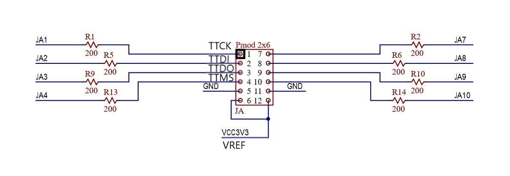

   Fig. 8: Pinout of the FPGA header (PMOD JA)

|

Tab. 13: Connection scheme for the Olimex debugger

+----------------+---------+
| FPGA PMOD (JA) |  Olimex |
+================+=========+
|1               |   TTCK  |
+----------------+---------+
|2               |   TTDI  |
+----------------+---------+
|3               |   TTDO  |
+----------------+---------+
|4               |   TTMS  |
+----------------+---------+
|GND             |   GND   |
+----------------+---------+
|VCC3V3          |   VREF  |  
+----------------+---------+

OpenOCD
-------
OpenOCD provides an interface for GDB to communicate with AIRISC. This is configured by ``.cfg``
files. For the Olimex there is one already in the ``/usr/local/share/openocd/scripts/interface/ftdi/``
directory, which is created during installation. There are also configurations for different interfaces.
A second configuration file is located in ``/bsp/airi5c.cfg`` and contains specific settings for the
AIRISC like its ID. In case of a connection via USB (like with the Nexsy Video) it is sufficient to
use only the ``/bsp/airi5c_usb.cfg`` file with the ``-f`` flag. A complete call for the Arty-A7 would
be for example: ``airi5c-base-core/bsp$ openocd -f /usr/local/share/openocd/scripts/interface/ftdi/olimex-arm-usb-tiny-h.cfg -f airi5c.cfg``.
Analogously for the connection via USB: ``airi5c-base-core/bsp$ openocd -f airi5c_usb.cfg``.

Its output is the following:  ::
	
    Open On-Chip Debugger 0.10.0+dev-01259-gfb477376d (2020-10-13-09:29)
    Licensed under GNU GPL v2
    For bug reports, read
        http://openocd.org/doc/doxygen/bugs.html
    DEPRECATED! use 'adapter speed' not 'adapter_khz'
    Info : auto-selecting first available session transport "jtag". To override use 'transport select <transport>'.
    airi5c.tap
    Info : Listening on port 6666 for tcl connections
    Info : Listening on port 4444 for telnet connections
    Info : clock speed 1000 kHz
    Info : JTAG tap: airi5c.tap tap/device found: 0x10001001 (mfg: 0x000 (<invalid>), part: 0x0001, ver: 0x1)
    Info : datacount=1 progbufsize=2
    Info : Examined RISC-V core; found 1 harts
    Info :  hart 0: XLEN=32, misa=0x101124
    Info : starting gdb server for airi5ctarget on 3333
    Info : Listening on port 3333 for gdb connections

Critical here is that the RISC-V core is found. This can be seen from the following lines: ::

    Info : Examined RISC-V core; found 1 harts
    Info :  hart 0: XLEN=32, misa=0x101124

``airi5c_usb.cfg`` must be located in the directory and can be found in the repository under
``./bsp/airi5c_usb.cfg``. In this configuration file the interface to be used as well as the
expected JEDEC IDs of the AIRISC soft core are specified. 

Upon successful communication and FPGA configuration, OpenOCD displays the connection to the
AIRISC debug module and waits for a connection using either telnet or GDB.

Further hints:

- To connect to the AIRISC via OpenOCD, an alternative driver has to be installed for the corresponding
USB device. Use the zadig tool and install the WinUSB driver. This applies as well for the connection
with or without the Olimex debugging interface. Example: Connection via OpenOCD using bsp/airi5c_usb.cfg,
no Olimex debugger. Install the WinUSB driver using zadig on Digilent USB device (Interface 0).

GDB
---
The GNU Debugging Bridge is used for debugging software on the AIRISC. The version used is 9.1. This
communicates with OpenOCD and can stop the processor at a defined point and e.g. display register
contents. This makes finding bugs much easier. To start this powerful tool you should first make
sure to start the GDB of the RISC-V toolchain and not the one of the host system architecture. The
correct call is therefore as follows: 
``:~$ riscv32-unknown-elf-gdb``

After that, the architecture must be specified and a connection to OpenOCD must be established.
This is done as follows: ::

    set arch riscv:rv32
    target extended-remote localhost:3333
    monitor reset halt

To avoid having to type this manually every time GDB is started, a ``.gdbinit`` file can be created
in the home directory. Content of this file are the three lines mentioned above. 

In the OpenOCD console the following entry should appear: ::

    Info : accepting 'gdb' connection on tcp/3333
    Info : JTAG tap: airi5c.tap tap/device found: 0x10001001 (mfg: 0x000 (<invalid>), part: 0x0001, ver: 0x1)

In the GDB console the .elf file must be loaded into memory. This is done by ``file test.elf`` and
``load``. After a successful load, the console should show which segments were loaded: ::

    (gdb) load
    Loading section .init, size 0x1f4 lma 0x80000000
    Loading section .text, size 0x2d28 lma 0x800001f4
    Loading section .rodata, size 0x81c lma 0x80002f1c
    Loading section .eh_frame, size 0x2c lma 0x80003738
    Loading section .data, size 0xc lma 0x80003764
    Loading section .sdata, size 0x8 lma 0x80003770
    Start address 0x80000000, load size 14200
    Transfer rate: 55 KB/sec, 2366 bytes/write.

The loaded program is started by ``monitor resume``. Some useful commands to test the AIRISC are the following:

Reset and stop core::

   monitor reset halt

Read out the first 10 instructions of the debug ROMS::

    monitor mdw 0x00000000 10

Write and read SRAM address with data/instructions::

   monitor mww 0x80000000 0x00000013
   monitor mdw 0x80000000

Readout timer value (MTIMEL)::

   monitor mdw 0xc0000010

Set GPIO outputs (control LEDs)::

   monitor mww 0xc0000008 0xaaaaaaaa
   monitor mww 0xc0000008 0x55555555

Output characters to the UART console::

   monitor mww 0xC0000024 0x00000069

Eclipse
-------
A good option for developing software is the Eclipse IDE. For this, neither OpenOCD nor GDB has to
be operated manually. Eclipse uses these tools in the background and offers a comfortable interface.
The connection with the JTAG interface must exist for this (`Connection of the Olimex JTAG Adapter
(Arty-A7 only)`_ or via USB ). For the RISC-V the *Eclipse IDE for Embedded C/C++ Developers* should
be installed in the current version. At the time of publishing this documentation we use version
2020-12 (4.18.0) Build id: 20201210-1552. Here as an example the project from the ``\bsp`` folder
should be imported and configured. Software development with Eclipse is not mandatory, it is also
possible to work with a Makefile and the RISC-V toolchain manually via the console. However,
Eclipse makes the workflow more comfortable. 

|

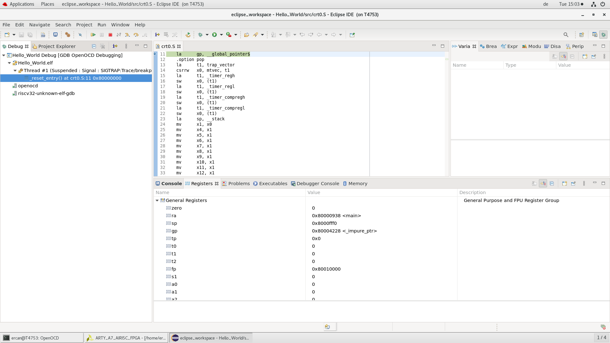

   Abb. 9: Eclipse Debugging View

|

Import of the software project into Eclipse
^^^^^^^^^^^^^^^^^^^^^^^^^^^^^^^^^^^^^^^^^^^
The software is located in the subfolder ``bsp`` and can be loaded into Eclipse using the Eclipse
Import Wizard. To do this, select ``Import`` from the ``File`` menu. In the opening wizard
``General`` - ``Existing Projects into Workspace`` is selected and the file location is specified by
``Next``. There the folder is selected and by clicking ``Finish`` the project ends up in the workspace. 

|

.. figure:: gfx/import1.png
   :width: 512

   Fig. 10: Eclipse import dialog. Selection of the project type

|

|

.. figure:: gfx/import2.png
   :width: 512

   Fig. 11: Eclipse Import dialog. Selection of the archive to be imported 

|

Alternatively, the Git repository can be imported instead of the Zip archive. In this case, it must
be ensured that the Git project is imported as a general project. (cf. Fig. 12)

|

.. figure:: gfx/import3.png
   :width: 512

   Fig. 12: Eclipse import dialog for a Git repository 

|

Eclipse configuration
^^^^^^^^^^^^^^^^^^^^^
After the import process, Eclipse should be configured. To do this, first specify the correct
toolchain path in the ``Preferences`` menu under ``Windows``. Similarly, the path to OpenOCD
must also be specified. 

|

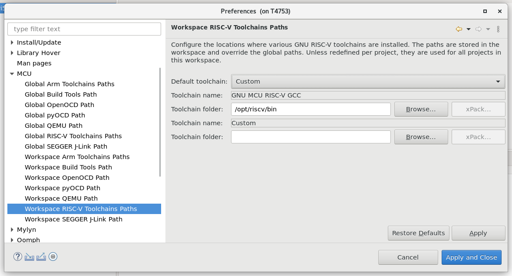

   Fig. 13: Eclipse: Selection of the toolchain directory

|

|

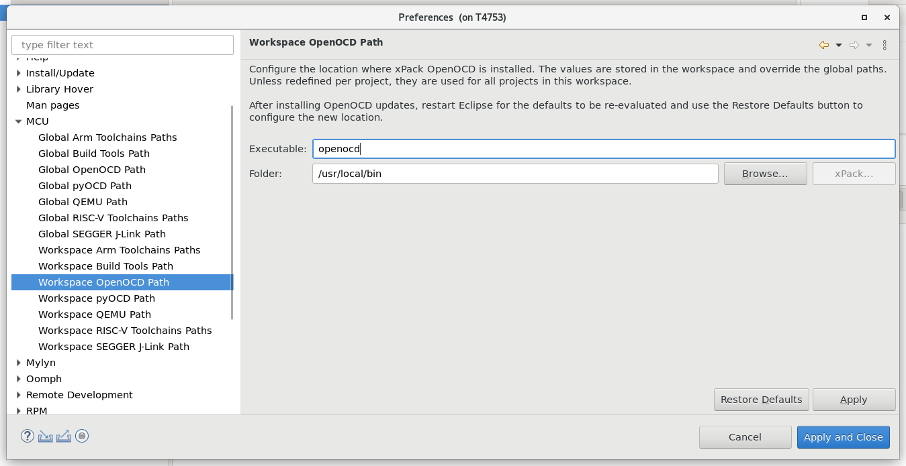

   Fig. 14: Eclipse: Selection of the OpenOCD directory

|

Depending on the installed toolchain, its name must be adjusted in Eclipse. This is done in the
project settings. A right click on the project name - ``Properties`` opens the corresponding
dialog. There you can specify under ``C/C++ Build`` - ``Settings`` - ``Toolchains`` how the prefix is.

|

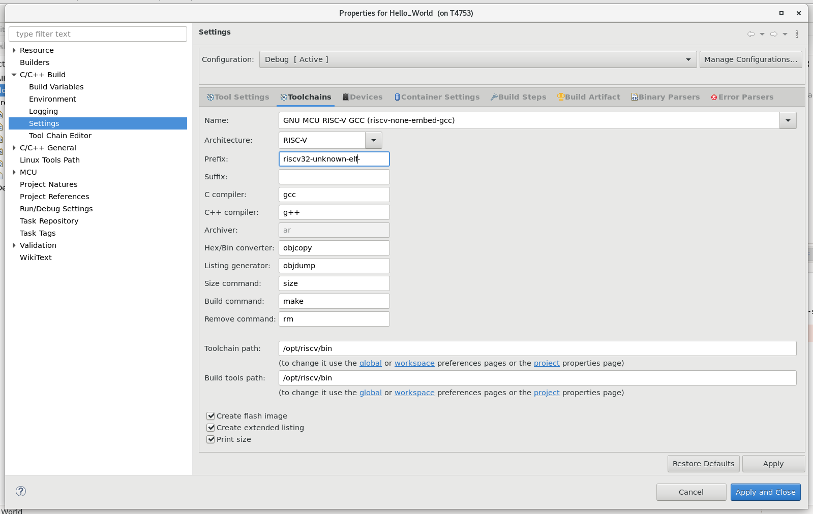

   Fig. 15: Eclipse: Selecting the correct toolchain. The prefix must be adapted 

|

After that a Debug Configuration should be created. This is done by right clicking on the project
name - ``Debug As`` - ``Debug Configuration``. There you select GDB OpenOCD Debugging and create
a new config by clicking the small icons in the upper left corner. In the new dialog you have to
make the changes according to Fig. 17 for a USB Adapter. In case you use the Olimex JTAG Adapter,
you have to change the Debug configuration according to Figure 18.

|

.. figure:: gfx/debug-config-app.png
   :width: 1024

   Fig. 16: Eclipse: Configuration of the debug target

|

|

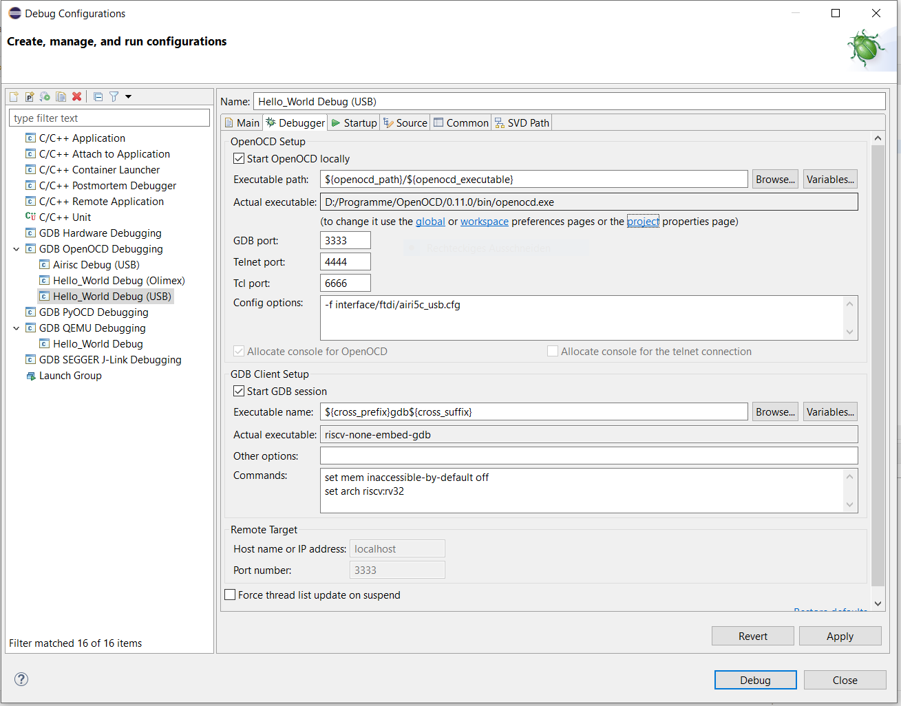

   Fig. 17: Eclipse: Configuration of the OpenOCD USB debug targets

|

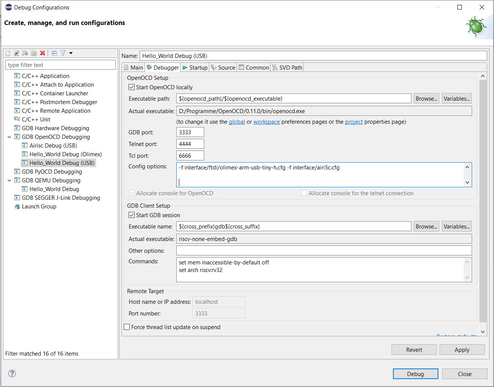

   Fig. 18: Eclipse: Configuration of the OpenOCD USB debug targets

|

Zadiq
^^^^^
When you work under Windows, an alternative driver has to be installed for the corresponding USB
devices to connect to the AIRISC via OpenOCD, Use the zadig tool and install the WinUSB driver.
This applies as well for the connection with or without the Olimex debugging interface. Example:
Connection via OpenOCD using bsp/airi5c_usb.cfg, no Olimex debugger. Install the WinUSB driver
using zadig on Digilent USB device (Interface 0).
https://zadig.akeo.ie/

Further hints:

- At the time of this commit, the C-Extension cannot be activated for software which is targetted to an FPGA-platform due to memory-access issues with the block RAM (``Project Preferences`` - ``C/C++ Build->Settings`` - ``Tool Settings``).
- The Commands-String under ``GDB Client Setup`` shown in Fig. 17 may result in errors during startup in certain configurations. Try using only "set arch riscv:rv32" and remove the remaining commands in that case.
- Under ``Debug-Configuration`` - ``Startup`` uncheck "Enable Arm semihosting".

Clicking on ``Build Project`` should now output the following to the console: ::

	15:42:45 **** Incremental Build of configuration Debug for project Hello_World ****
	make all 
	Invoking: GNU RISC-V Cross Print Size
	riscv32-unknown-elf-size --format=berkeley "Hello_World.elf"
	    text	   data	    bss	    dec	    hex	filename
 		14834	   2108	     60	  17002	   426a	Hello_World.elf
	Finished building: Hello_World.siz
	15:42:45 Build Finished. 0 errors, 0 warnings. (took 169ms)
 

With a right click on the project -> ``Debug as`` -> ``Debug Configurations`` -> ``Debug`` the debugging view is started. 

Test and validation
-------------------

Hello World
-----------
In the "Hello World" Eclipse project, the basic functionality is demonstrated.
The following components of the core are used for this purpose:

- UART Interface
- TIMER
- GPIO
- Custom Instructions

After a start the program displays a menu on the serial console, there the options are described.
On the one hand the state of the GPIOs can be toggled, these are connected to the on-board LEDs
on the FPGA. On the other hand a timer can be started, this gives a message on the serial console
every second. Additionally a custom instruction can be executed, this demonstrates the possibility
to extend the core with the PCPI interface to implement special hardware acceleration. 

Benchmarking
------------

CoreMark
^^^^^^^^
CoreMark is the de facto standard to compare the performance of processors in the embedded area.
The implementation for AIRISC is located in the ``airi5c`` folder in the ``coremark`` directory.
To compile this, the riscv-toolchain must have been fully installed, then it is sufficient to run
make with a reference to the appropriate port. This is done from the ``coremark`` directory as
follows: ``make PORT_DIR=airi5c``. The binary is named ``coremark.elf`` and is located in the
same directory. 

The results of the core are listed in the front page's README.md for an FPGA implementation.

Reference portings
------------------

FreeRTOS
^^^^^^^^

A FreeRTOS demo application is located as an Eclipse project in the subdirectory ``\sw\AIRI5C_FreeRTOS``.
This is a port of the official FreeRTOS blinky demo. Two processes are created which communicate with
each other. The first process sends a message to the second one, which prints the message over the
serial console. In the background a scheduler ensures that both processes get the necessary execution
time on the processor. The functionality of the two privilege levels U/M and the system timer is shown. 

The output of the serial console can be displayed e.g. with Cutecom or Putty. The baud rate is 76800,
the parity even. The following output should appear in the console::

    Starting...Blink
    Blink
    Blink
    Blink
